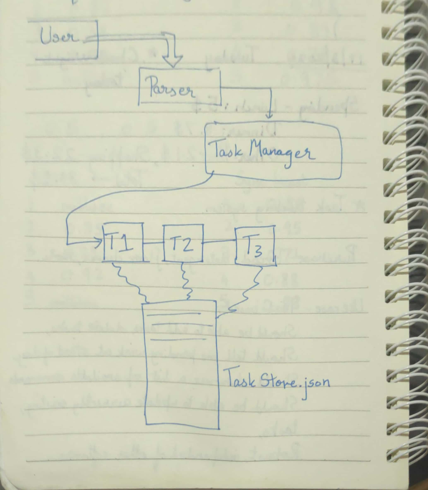

# Task-Tracker
Basic task tracker to keep myself organised. Will build on it incrementally as and when I find time.

1. main.py contains infinite loop to process user commands.

2. core.py has the essential components (Parser, Task Manager, Tasks).

3. data.json stores the tasks in json format.

# User Guide
To execute, type the following in a terminal in the Task Tracker repository:

```bash
$ python3 main.py
```

There are 4 types of commands you can run:
1. **add** - Add a task. You will be prompted for a description and a due date. A task ID will be assigned automatically to your task.
2. **update** - Update a task. You will be prompted for a task ID. If it exists, you will be prompted for an updated description and due date.
3. **delete** - Delete a task. You will be prompted for a task ID. If it exists, the corresponding tasks will be deleted.
4. **show** - There are three commands here. 
   1. **show all** - show all tasks
   2. **show day** - show all tasks with due dates today
   3. **show week** - show all tasks with due dates within a week from now

Besides these, you can always run **help** and **exit** as and when required. 

### Important

Typing **exit** is necessary for saving the tasks back onto file so that they persist for the next time you run Task Tracker.

# Developer Guide

The main.py file runs an infinite loop accepting commands at a $ prompt.
Accepted command is passed into a Parser class object.

The code in core.py is organized into three main classes:

+ **Parser** - This is the class exposed to the user. processCommand function accepts user input command, say X and calls appropriate functions processX (X -> add, update, delete, exit and so forth).
+ **Task Manager** - Class for managing the tasks created. Stores tasks as a list of Task class objects. On exit, dumps existing tasks as a json into data.json. On program execution, loads those records from data.json into the list of tasks it maintains.
+ **Task** - Class that models a task. Attributes - task description, task due date, task date added, and a unique task ID.

### To add a new command say 'modify'
1. Add 'modify' into VALID_COMMANDS list in Parser class
2. Add a handler function (ideally, processModify) in Parser class to be called to process the command
3. Add a condition in processCommand function in Parser class to call the handler function created in 2 upon detecting that user has entered 'modify'




